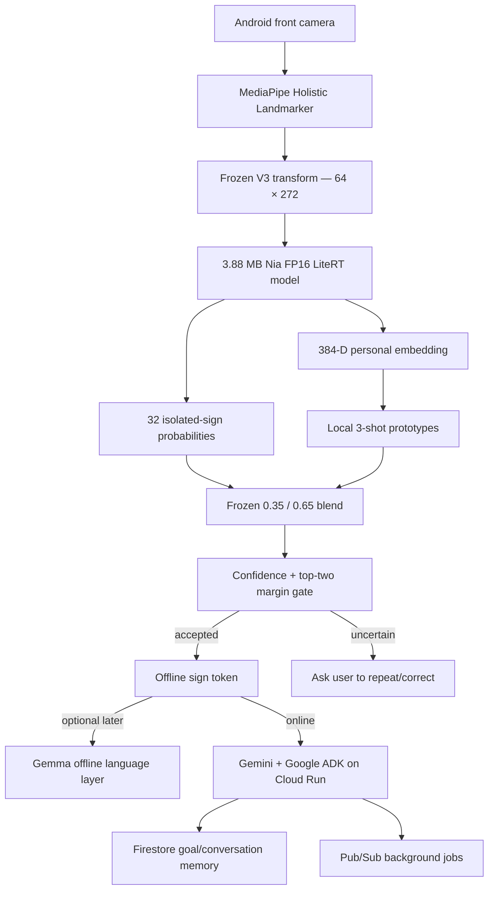

# Architecture

Raw camera frames, landmarks, and personal embeddings remain on device. Only accepted labels and confidence metadata are sent to the online agent. Pub/Sub is reserved for non-urgent work; immediate replies stay synchronous.

