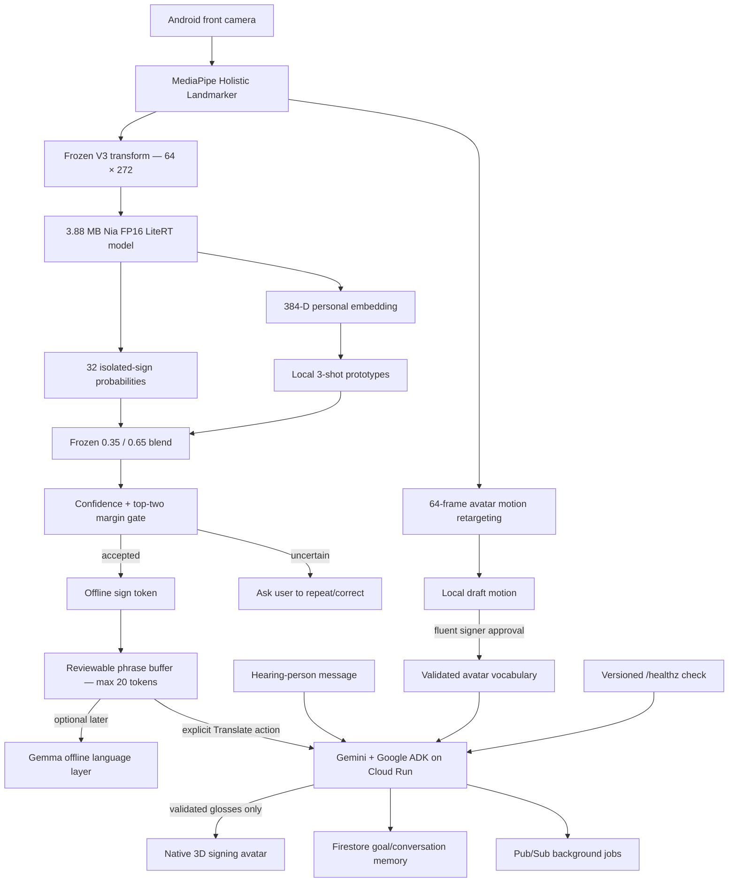

# Architecture

Raw camera frames, landmarks, avatar motion, and personal embeddings remain on device. Separately captured accepted signs accumulate in a bounded local buffer and remain reviewable until the user clears them. Only when the user explicitly requests translation are the accepted labels, confidence metadata, user-correction markers, and available validated gloss names sent to the online agent. A hearing-person message is sent only when supplied. Pub/Sub is reserved for non-urgent work; immediate replies stay synchronous.

Each installation creates a random anonymous `install-<UUID>` value in private
preferences. It separates Firestore conversation paths without using hardware,
account, advertising, or contact identifiers. Android automatic backup and
device transfer are disabled for Nia's private files and preferences. Reinstalling
after clearing app data therefore creates a new cloud identity.

The backend accepts only bounded ASCII letters, digits, underscores, and hyphens
for user, session, request, and Pub/Sub message identifiers before constructing
Firestore document paths.

The Android client treats the cloud layer as optional. Its health handshake
requires `service=project-nia-agent` and `api_version=1`; an arbitrary HTTP 200
response is not considered compatible. HTTP 401/403 is reported separately so
a private Cloud Run deployment is never mistaken for a generic network outage.
Offline recognition, local personalization, and already-approved avatar motion
remain available when the agent is absent.

Online calls are correlated end to end with a unique `request_id`. The Android
client accepts only the matching response and independently rechecks every
returned gloss against the signer-approved vocabulary included in that request.
One unknown gloss rejects the complete sequence; the client never removes the
unknown item and plays the remaining fragment. This duplicates the backend
allow-list intentionally so either side fails closed if the other is faulty.
